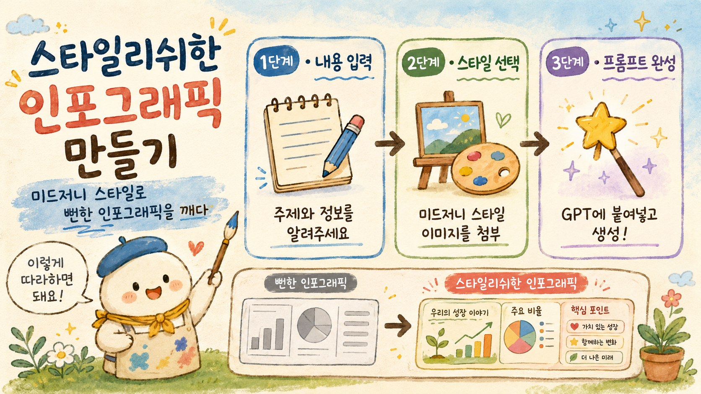

<!-- 타이틀 배너: GPT로 생성한 타이틀 이미지를 아래 경로에 넣어주세요 -->

# stylish-infographic-by-blue

> 미드저니 스타일을 "스타일 앵커"로 끼워, 뻔하지 않고 **스타일리쉬한 인포그래픽**을 만드는 GPT 프롬프트 빌더 스킬.

GPT나 NanoBanana에게 "인포그래픽 만들어줘"라고 하면 결과가 하나같이 뻔합니다 — 깔끔하지만 천편일률인 기업용 플랫 벡터죠. 이 스킬은 미드저니 **style explorer**가 주는 무한대의 시각 스타일을 GPT 프롬프트에 이식해서 그 뻔함을 깹니다.

**산출물은 언제나 "GPT에 붙여넣을 프롬프트 텍스트"입니다.** 실제 이미지 생성은 여러분이 GPT/NanoBanana에서 직접 합니다.

---

## 왜 필요한가 — "infographic 프레이밍 함정"

프롬프트에 `infographic`이라고만 쓰면 모델은 학습된 관성대로 **깔끔한 기업용 플랫 벡터**를 그립니다. 색·질감 지시를 줘도 이 관성에 묻혀 티가 안 나죠.

이 스킬은 프롬프트를 **4블록 골격**으로 짜서 그 관성을 정면으로 깹니다.

1. **프레이밍 역전** — "infographic" 대신 "손그림 포스터 / 일러스트"로 규정
2. **메인 비주얼** — 화면 중앙에 큰 일러스트 하나(예: 해부 심장, 김 나는 커피잔)
3. **정보 구조** — 섹션·비교·단계·아이콘 배치
4. **금지문** — "기업용 플랫 벡터처럼 보이지 마라"로 회귀 차단

---

## 설치

1. [`stylish-infographic-by-blue.skill`](stylish-infographic-by-blue.skill) 파일을 내려받습니다.
2. Claude Cowork에서 **Save skill**로 설치합니다.
3. "스타일리쉬한 인포그래픽 만들어줘" 또는 `/stylish-infographic-by-blue`로 호출합니다.

---

## 사용법 (3모듈)

| 모듈 | 하는 일 |
|------|---------|
| **1. 내용 + 기본 프롬프트** | 주제·정보를 받아 디자인 없는 "맨 기본" 프롬프트(A)를 만듦 |
| **2. 스타일 입히기** | 미드저니 스타일 이미지를 분석해 4블록 + 스타일 앵커로 "스타일 프롬프트"(B)를 만듦 |
| **3. 피드백 수정** | GPT 결과 이미지를 올리면 진단 후 프롬프트를 다듬음 |

> ⚠️ 스타일 프롬프트(B)는 **그 미드저니 스타일 이미지를 GPT에 함께 첨부**해야 작동합니다. 첨부를 빼먹으면 스타일이 반영되지 않아요.

---

## ✨ 직접 테스트해보기 — 스타일 샘플

아래 3개는 미드저니 style explorer에서 뽑은 **스타일 그리드 샘플**입니다. 마음에 드는 걸 골라 **GPT에 함께 첨부**하고, 이 스킬로 만든 프롬프트를 붙여넣으면 그 스타일의 인포그래픽이 나옵니다.

| 샘플 ① | 샘플 ② | 샘플 ③ |
|:--:|:--:|:--:|
|  |  |  |
| `--sref 2384086419` | `--sref 519289624` | `--sref 328238126` |
| 표현주의 컬러 잉크 스케치 | 흑백 연필 노트 스케치 | 기하 저폴리 모자이크 |

### 테스트 순서

1. 위 샘플 중 하나를 **다운로드**합니다.
2. 스킬에게 만들고 싶은 인포그래픽 주제를 알려줍니다. (예: "수면이 건강에 미치는 영향, 한글, 1:1")
3. 스킬이 만들어준 **스타일 프롬프트(B)**를 복사합니다.
4. GPT(ChatGPT)에 **★그 스타일 이미지를 첨부★** 하고 프롬프트를 붙여넣습니다.
5. 생성! 결과가 아쉬우면 그 이미지를 다시 스킬에 올려 진단·수정을 받습니다.

---

## 결과 예시

같은 골격에 스타일만 바꿔 끼운 결과들입니다. (왼쪽: 기본 / 오른쪽: 스타일 적용)

<!-- 예시 이미지를 넣어주세요. 작업 폴더의 결과물 중 골라서 경로를 채우면 됩니다. -->
<!-- 예:   -->

---

## 이 스킬이 하지 않는 것

- 실제 이미지 생성 (GPT·NanoBanana에서 직접)
- 미드저니 sref 검색·이미지 생성
- HTML/SVG 인포그래픽 직접 렌더
- 디자인 시스템(bds) 토큰 파일 생성

---

## 만든 사람

**Blue (조남경)** · 미드저니 코리아
미드저니 × Claude를 잇는 실험에서 출발한 스킬입니다.
